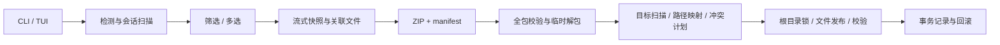

# 技术架构

## 目标与选型

AgentMoving 是离线单进程工具：同一种 Agent 的原生会话在不同主机/系统间迁移。Rust 2024 edition；Ratatui 0.30 + Crossterm 0.29；clap 4；serde/serde_json；ZIP Deflate；SHA-256；tempfile；walkdir。依赖精确解析结果在 Cargo.lock。

程序不携带解释器，不启动服务，不访问网络，也不执行从聊天数据中读出的命令。按目标系统/架构分别构建二进制。release 开启 thin LTO、strip 和单 codegen unit。

发布工作流中 Linux 使用 musl 目标；Windows x64 MSVC 在 `.cargo/config.toml` 中启用静态 C runtime；macOS 使用系统动态库。这些配置用于减少目标机器额外依赖，Windows/Linux 的实际产物仍需通过各自 CI 验证。

目前无需自己的持久化数据库。Codex SQLite 属于第三方内部状态，不直接修改、不复制覆盖。是否能发现与恢复会话通过版本级原生验证判断，而非仅以文件复制成功为准。

## 模块

| 模块 | 职责 |
|---|---|
| `model.rs` | Agent、数据根目录、会话摘要、包清单与资源限制 |
| `agents.rs` | 可执行程序检测、根目录解析、原生 JSONL 扫描、关联文件收集 |
| `paths.rs` | 可移植路径校验、跨系统路径映射、项目目录编码 |
| `archive.rs` | 快照导出、ZIP 写入、校验与受限解包 |
| `import.rs` | 路径变换、冲突计划、发布、事务记录与回滚 |
| `tui.rs` | 终端向导、搜索多选、后台任务和进度 |
| `main.rs` | CLI 参数、结构化输出、退出状态 |

三个适配器使用枚举分派，避免第一版引入动态插件 ABI。新增 Agent 需要同时定义检测规则、会话解析、依赖范围、目标路径规则与兼容性测试，不能只注册一个目录。

## 数据流

## 检测与扫描

程序检测 PATH、用户 `.local/bin` / `.cargo/bin` 和常见 Homebrew 位置中的命令文件，但不运行程序猜测版本。包中 Agent 版本来自会话自身元数据；找不到版本就保持未知。

默认扫描环境变量生效位置及约定的用户目录；显式 `--root` 替代默认候选。限制为当前账户可读目录；不扫描整个磁盘，不遍历 symlink，不提升权限寻找其他账户。遍历深度限制 24；所有遍历/解析错误进入扫描报告。

元数据读取逐行进行，提取 ID、cwd、时间、摘要、版本、归档状态及 Pi 父会话。正文不常驻内存；扫描时完整检查 JSONL，因此首次扫描大量会话可能花费较长时间。TUI 通过后台工作线程保持界面刷新。

Claude 子 Agent 文件随主会话导出，不作为独立顶层会话重复展示。Pi 分支保持原生 JSONL；导出闭包包含已扫描到的 parentSession。

## 原生数据保留与变换

导出文件逐字节保留。导入时仅改以下已知位置：

- Codex：`session_meta.payload.cwd`、`turn_context.payload.cwd`。
- Claude Code：记录顶层 `cwd`，以及按项目路径编码的目录位置。
- Pi：session header 的 `cwd` / `parentSession`，以及目标项目会话目录。

不递归替换任意同名字段，不替换对话、工具参数、工具输出或历史命令里的路径。未变动记录保留原始字节；变动记录以 JSON 重新序列化，未知字段保留。父子消息 ID、工具调用 ID、压缩/分支记录不重建。

源路径字符串在宿主系统上不交给 `Path` 解析；先把分隔符归一化，再做最长前缀、目录边界匹配。目标路径最终交给目标系统处理。映射区分大小写，Windows 源路径应使用扫描报告中的原始大小写。

Claude 超过 200 字符的项目编码涉及版本相关哈希，本版拒绝生成此类映射，要求选择更短目标路径。Pi 接受分组目录或自定义平铺会话目录，导入统一生成项目分组。

## 导出一致性

读取前后比较大小和 mtime，再次计算摘要验证内容未变；完成包后重新执行包校验，最后以不覆盖方式发布输出。若某个文件持续变化则停止导出，不产生成功包。

这保证每个文件的一致快照，不保证第三方 Agent 的多个文件拥有同一事务时间点。可靠迁移应先停止源会话。工具不会强制停止 Agent。

## 导入事务

1. 解包到系统临时目录，检查所有条目与 manifest 一致。
2. 在第二个临时目录准备变换后的文件。
3. 完整扫描目标，比较 ID、路径和 SHA-256，生成 `new/identical/conflict/blocked` 计划。
4. dry-run 在此结束，不创建目标根目录。
5. 应用时按固定顺序获取每个目标根目录的 `.agentmoving.lock`，再次检查目标文件。
6. 每个新文件先写入其目标目录的临时文件并 sync；写前日志持久化后，以 `persist_noclobber` 发布；再次校验。
7. 记录 completed。任何普通写入错误均尝试撤回本事务的新文件。

不更新既有会话，不提供覆盖模式，所以无需为既有聊天制作覆盖备份。事务记录保留文件路径和导入内容摘要。回滚删除前比对摘要，目标已变化则保留并记入 rollback-incomplete。

跨目录/跨文件的发布不是单一原子事务；强制终止可能留下部分新文件和锁，需要用事务记录恢复。锁只约束 AgentMoving，不约束 Agent；不能与目标 Agent 并发写入。写前日志与目标发布间存在小窗口，不抵御同权限恶意进程故意制造竞争。恢复时应停止 Agent 并保留原始事务目录。

## 资源与输入约束

- 单 JSONL 行最多 64 MiB；单文件最多 2 GiB。
- 包 payload 总量最多 20 GiB；manifest 最多 16 MiB；payload 最多 100,000 个。
- 路径禁止绝对路径、`..`、空组件、反斜杠、盘符/ADS、控制字符和 Windows 保留名；组件最多 255 UTF-8 字节。
- 拒绝重复/大小写冲突 ZIP 条目、额外未列明文件、symlink、大小不匹配、摘要不匹配和主会话元数据不一致。
- 目标文件必须处于适配器允许的会话目录范围。检查已有路径祖先，拒绝 symlink；Windows 也拒绝 reparse point。
- TUI/普通 CLI 显示过滤控制字符；JSON 输出由 JSON 序列化转义。

摘要提供损坏检测，不提供签名或来源认证。普通 ZIP 不加密。源包和目标临时变换可能同时占用磁盘空间，迁移较大历史前需要预留空间。

## 验证策略

合成数据覆盖三种原生格式、Windows 源路径到宿主路径的映射、父子引用、未知字段保留、重复导入、冲突、损坏 ZIP 和恢复策略。测试不读取真实聊天。

原生 Codex smoke 使用临时 CODEX_HOME 和合成 rollout，由已安装的 app-server 执行 thread/list/read；不发 turn/start。它验证该版本的发现和读取，不证明所有客户端 UI、所有历史格式或真实后续模型轮次都兼容。

CI 为三系统配置编译、lint 和测试，并构建平台二进制。配置存在不等于远端工作流已运行成功。发布前仍需完成对应平台和 Agent 的原生验收矩阵。
